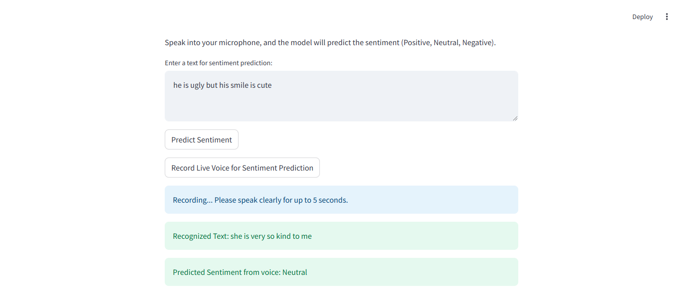

# Voice and Text Emotional Analysis

"This Streamlit application allows users to analyze the sentiment (Positive, Neutral, Negative) of text input or live voice input.


[Voice-and-Text-Emotional-Analysis-With-Streamlit](https://github.com/Rajesh7094/Voice-Text-Emotional-Analysis.git)


###  If you have any doubt or want to contribute feel free to hit me up on (rajesherode2004@gmail.com)

# Voice and Text Emotional Analysis With Streamlit
### Main Page


### Neutral Prediction via Text


### Positive Prediction via Voice


### Neutral Prediction via Voice


### Negative Prediction via Voice


## Requirements
* Python 3.X
* streamlit
* scikit-learn
* SpeechRecognition
* pandas
* numpy
* joblib
* PyAudio


## How to Run
* Clone the repository

```
$ git clone https://github.com/Rajesh7094/Voice-Text-Emotional-Analysis.git
```
* Setup Virtual Environment

```
$ python -m venv env
```
* Activate the virtual environment

```
$ env\Scripts\activate
```
* Install dependencies using

```
$ pip install -r requirements.txt
```
* Run Streamlit

```
$ streamlit run main.py
```
</br>


## Acknowledgements
If you have any doubt or want to contribute feel free to hit me up on (rajesherode2004@gmail.com)
The app uses the Streamlit(<https://github.com/streamlit/streamlit>) library for the user interface.**

